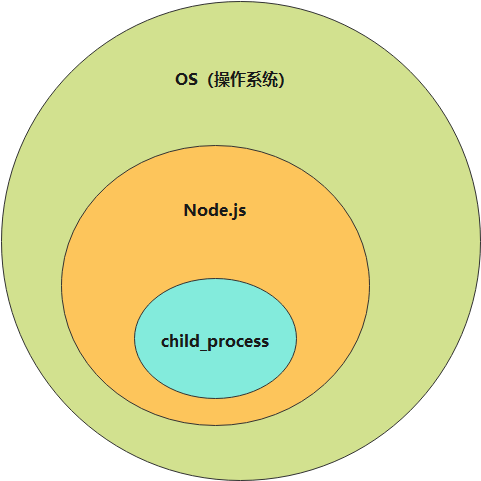

# Node 多进程开发入门

### 什么是进程？

进程的概念主要有两点：

- 1、进程是一个实体。每一个进程都有它自己的地址空间。
- 2、进程是一个“执行中的程序”，存在嵌套关系
  

我们在 child_process 中创建的进程就是 node 的子进程

```bash
# 查看所有进程
s -ef
# 查看node进程
s -ef|grep node
```

### child_process 用法

源码目录：/best-test/bin/process

#### 异步

- exec

```javascript
cp.exec('ls -al|grep node_modules', function (err, stdout, stderr) {
  console.log(err, stdout, stderr);
});
```

- execFile

```javascript
cp.execFile(path.resolve(__dirname, 'test.shell'), ['-al'], function (err, stdout, stderr) {
  console.log(err, stdout, stderr);
});
```

- spawn

```javascript
const child = cp.spawn(path.resolve(__dirname, 'test.shell'), ['-al'], {
  cwd: path.resolve('..'),
});
// console.log(child.pid, process.pid);

child.stdout.on('data', function (chunk) {
  console.log('stdout', chunk.toString());
});
child.stderr.on('data', function (chunk) {
  console.log('stderr', chunk.toString());
});
```

- spawn/exec/execFile 区别
  spawn: 适合耗时任务（比如：npm install），需要不断日志反馈;
  exec/execFile: 适合开销较小的任务

- fork
  > 会启动两个进程 Node(main) -> Node(child)

```javascript
// index.js
const child3 = cp.fork(path.resolve(__dirname, 'child.js'));
child3.send('hello child precess!!', () => {
  // child3.disconnect();
});
child3.on('message', (msg) => {
  console.log(msg);
});
console.log('main pid:', process.pid);

// child.js
console.log('child process');
console.log('child pid:', process.pid);

process.on('message', (msg) => {
  console.log(msg);
});

process.send('hello main process!!');
```

#### 同步

- execSync/execFileSync/spawnSync

```javascript
const ret = cp.execSync('ls -al|grep node_modules');
console.log(ret.toString());

const ret2 = cp.execFileSync('ls', ['-al']);
console.log(ret2.toString());

const ret3 = cp.spawnSync('ls', ['-al']);
console.log(ret3.stdout.toString());
```
