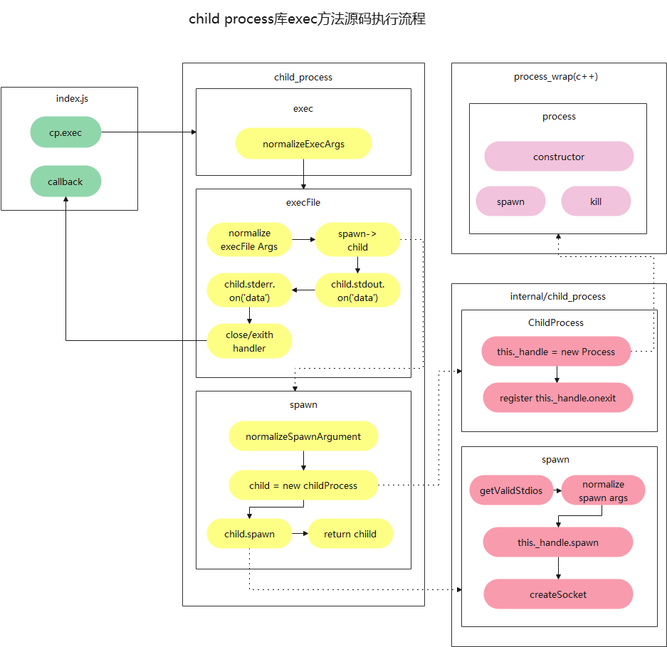

# Node 多进程开发进阶

## exec 源码深入分析

- child_process
  exec/ecexFile/spawn

- internal/child_process
  ChildProcess/spawn



## Fork 执行流程分析

核心区别是创建 Channel 取代[stdin,stdout,stderr]

## 同步方法源码分析

核心是调用 Process.spawnSync

### Node 多进程源码总结

#### exec/execFile/spawn/fork 的区别

- exec：原理是调用 `/bin/sh -c` 执行我们传入的 shell 脚本，底层调用了 execFile
- execFile：原理是直接执行我们传入的 file 和 args, 底层调用 spawn 创建和执行子进程,并建立了回调，一次性将所有的 stdout 和 stderr 结果返回
- spawn：原理是调用了 internal/child_process，实例化了 ChildProcess 子进程，再调用 child.spawn 创建子进程并执行命令，底层调用了 child.\_handle.spawn 执行 process_wrap 中的
  spawn 方法，执行过程是异步的，执行完毕后通过 PIPE 进行单项数据通信，通信结束后会子进程发起 onexit 回调，同时 Socket 会执行 close 回调
- fork：原理是通过 spawn 创建子进程和执行命令，通过 setupchannel 创建 IPC 用于子进程和父进程之间进行双向通信

#### data/error/exit/close 回调的区别

- data：主进程读取数据过程中通过 onStramRead 发起的回调
- error：命令执行失败后发起的回调
- exit：子进程关闭完成后发起的回调
- close：子进程所有 Socket 通信端口全部关闭后发起的回调
- stdout close/stderr close：特定的 PIPE 读取完成后调用 onReadableStreamEnd 关闭 Socket 时发起的回调

### shell 的使用

```bash
# 方法一：直接执行shell 文件
/bin/sh test.shell
# 方法二：直接执行shell 语句
/bin/sh -c "ls -al|grep node"
```
